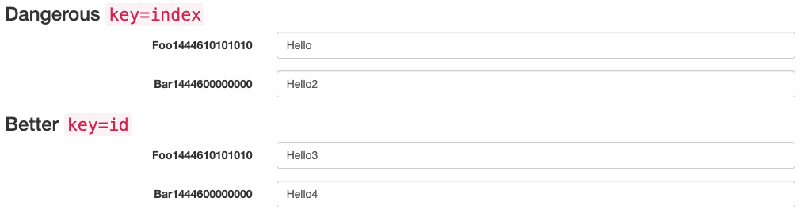
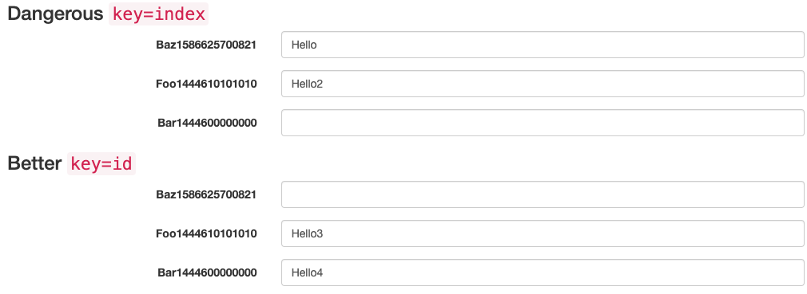

<p><b>IMPORTANT DISCLAIMER:</b> I absolutely, 100%, without a doubt believe that you should use  unique, consistent keys when rendering a list of components. Now that's out the way I am going to attempt to justify my click baity title.</p>

<h2>Some Context On Indexes and Keys</h2>

<p>When mapping over elements in a React component like so:</p>

```jsx
function NavLinks({ linksArray }) {
  return linksArray.map(link => <a href={link} />);
}
```

<p>You may have got the following warning in the console:</p>


<p>React is asking for you to give each component in an array of components a 'unique key prop'. So you could simply add this onto the following bit of code right?</p>

```jsx
function NavLinks({ linksArray }) {
  return linksArray.map((link, index) => <a href={link} key={index} />);
}
```

<p>Well according to the <a href='https://reactjs.org/docs/lists-and-keys.html'>React documentation on list and keys</a> this is not the way you do it and is considered an <a href='https://medium.com/@robinpokorny/index-as-a-key-is-an-anti-pattern-e0349aece318'>anti-pattern</a>. The correct way to do it would be something similar to as follows.<p>

```jsx
function NavLinks({ linksArray }) {
  return linksArray.map(link => <a href={link} key={link} />);
}
```

<p>This post will investigate when you should and shouldn't care about the key prop and give some insight into why there is such a big fuss around the key prop and indexes.</p>

<h2>Why You Should Care</h2>

<p>The main reasons for React reiterating so much not to use index as a key is for two main reasons; performance on render and reduce unwanted side effects.</p>

<p>In regards to performance <a href='https://reactjs.org/docs/reconciliation.html'>React has made some optimizations</a> to take a state of the art tree diffing algorithm, which has a complexity in order of  O(n3), to a complexity of O(n). This is because React allows developers to pass other parameters or 'props' to the tree so it can create some optimizations. The best way to show the optimizations is through code. So, in our first code snippet we have a div containing 3 components rendered using a map of the input array. For context we can say that &lt;Post/&gt; below post has a big render tree. Whether we have used the index or the value to render the list of components is irrelevant in the first code snippet.<p>

```jsx
// input [1,2,3]
<div>
  <Post key="1">1</Post>
  <Post key="2">2</Post>
  <Post key="3">3</Post>
</div>
```

<p>Let's say that the user has filtered the input data to now include a number 4 at index position 1 (for anyone who uses MATLAB index position 2...not that anyone does). We want to reduce the amount of re renders the DOM has to perform on the whole component tree. In the code snippet I denoted ✅ for a (re)render (these are bad) and a 🚫 if no re-render is required.</p>

```jsx
// input [1,4,2,3]
// rendered using index
<div>
  <Post key='1'>1</Post> // 🚫 rerender
  <Post key='2'>4</Post> // ✅ render
  <Post key='3'>2</Post> // ✅ rendered
  <Post key='4'>3</Post> // ✅ rendered
</div>

// rendered using value
<div>
  <Post key='1'>1</Post> // 🚫 rerender
  <Post key='4'>4</Post> // ✅ render
  <Post key='2'>2</Post> // 🚫 rerender
  <Post key='3'>3</Post> // 🚫 rerender
</div>
```

<p>Straight away we can see that the number of re-renders using the index as oppose to a unique ID is 3x the amount.  In theory our application would be 3x slower, however in practice it would be no way near this amount due to the other optimizations in the diffing and rendering algorithm. This is because everything with an index above the index we insert our component into has had to re-render due to the key being passed. Just imagine if this was a list of 30 items and we entered a new component in near the start! So just by choosing to use something other than index we have improved our number of re-renders.</p>

<p>Now you might be saying 'I only have up to 5 items in my list, the performance benefit would be negligible' and you would be 100% right. However as mentioned earlier not using a consistent unique key could result in unexpected side effects could occur such as the mix up in elements on a mutation of the list being mapped. The best example I have seen on this is in this <a href='https://jsbin.com/wohima/edit?output'>JS Bin</a>. When you load up the JS Bin and enter some information into the input boxes nothing out the ordinary happens.</p>



<p>However if we add an item to the beginning of the list of dangerous items, we see that the labels have been ordered correctly, however the inputs haven't.</p>



<h2>Other Side Of Explanation</h2>

<p>Now to address the click baity question of the title - why you shouldn't care? To be honest I worded that poorly and should be said more as when shouldn't I care as it is more the context to decide if you should care or not. I'm going to keep this short. You should only care if your list is always going to be static. So for example on my website homepage the blog posts are rendered using a map and the ordering of this is never doing to change in the lifecycle of the components and therefore it would be 'safe' to use it on this component - I have used a unique ID to render these I might add.</p>

<h2>Wrapping Up</h2>

<p>So as sort of a TLDR - always use a unique static key for each mapped component other than if you have no choice but to use the index and the data is static.</p>
