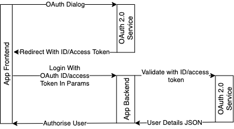

<p>
  In a situation where you want to implement
  <a href="https://oauth.net/2/">OAuth 2.0</a> in a fullstack
  application where the backend doesn&#x27;t use a traditional API with
  multiple endpoints can be challenging as I found recently, especially
  when you need to do some validation on the user to make sure they are
  authorised to use the application. This is because the authentication
  service you are using needs a redirect URI or a callback URL to
  redirected back after the user has completed (whether this be
  successful or unsuccessful) the authentication flow.
</p>
<p>
  The most obvious and straight forward solution would be to add an
  additional endpoint onto your backend for the callback and then use
  OAuth 2.0 in a traditional semi-RESTful manner and then use a library
  such as <a href="http://www.passportjs.org/">PassportJs</a> if
  you&#x27;re using Node.js. However, there were two problems I had with
  this. PassportJs requires that you use an express based server (where
  I was using <a href="https://koajs.com/">Koa.js</a>) and I wanted to
  try and stick to the one GraphQL endpoint for the entire application.
</p>
<h2>The Solution</h2>
<p>
  The solution I came to was a semi-duplicated, two-stage OAuth 2.0
  solution. The ID token for the user is retrieved on the frontend using
  <em>normal</em> OAuth 2.0. Then the ID token is sent to the backend
  for further authentication against an OAuth 2.0 API. This is probably
  better explained using the diagram below.
</p>



<p>
  First, the user is presented with a typical login dialogue where they
  can select their authentication method. The OAuth 2.0 authentication
  service used in this example is Google. And for this I have kept it
  very simple by using the
  <a href="https://www.npmjs.com/package/react-google-login"
    >react-google-login</a
  >
  library, which includes the Google styled login button and the OAuth
  functionality, handling redirect to authentication URL using the<a
    href="https://developers.google.com/identity/sign-in/web/reference"
  >
    Google Sign-In JavaScript client</a
  >
  and mapping the data to a JSON object. However, you could implement
  this yourself if required.
</p>

```jsx
<GoogleLogin
  clientId="YOU_CLIENT_ID_HERE"
  buttonText="Login Using Google"
  onSuccess={userData => {
    /*Send to graphql endpoint*/
  }}
  onFailure={userData => {
    /*SOME ERROR CODE HERE*/
  }}
  cookiePolicy={'single_host_origin'}
/>
```

<p>
  This will then give you a JSON object with
  <a
    href="https://github.com/anthonyjgrove/react-google-login/blob/master/index.d.ts#L9"
    >a lot of properties</a
  >
  about the user on it including their ID token. This is what we will be
  sending to the GraphQL endpoint to confirm the authentication.
</p>
<p>
  You&#x27;ll notice that there is a lot of data on the returned object
  about the user such as their email address and you make ask why do we
  need to authenticate them again? If we simply authenticated them once
  on the frontend and sent the data to the backend then you could be
  susceptible to cross-site request forgery where the user could change
  the key that authenticates them against your database as someone they
  are not. So we send the ID token which is temporary a token, that can
  only be accessed by logging into the service as the user and is
  therefore much more difficult to forge.
</p>
<p>
  A basic example of the GraphQL request that is sent is as follows.
</p>

```graphql
mutation SignInUsingGoogle($googleIdToken: String!) {
  signInUsingGoogle(googleIdToken: $googleIdToken) {
    uid
    username
    givenName
    familyName
    pictureUrl
  }
}
```

<p>
  So we&#x27;ve now got a Google ID token to the backend. What now?
</p>
<p>
  We need to get the user details from the server using a OAuth 2.0 API
  endpoint. Google has a package called google-auth-library which
  provides functions for OAuth 2.0 authorization and authentication with
  Google APIs. For this, we will be using the verifyToken token function
  which is available in the <em>OAuth2Client </em>class.
</p>

```javascript
const googleOAuthClient= new OAuth2Client(
  'YOU_CLIENT_ID_HERE'
)

const payload = await googleOAuthClient
  .verifyIdToken({
    idToken: userToken.googleAccessToken,
    audience: '751408790492-tj4hkuljnlqpu82q15fhbdcitt0gj4i6.apps.googleusercontent.com',
  })
  .then((ticket) => ticket.getPayload())

if (!payload) {
  throw new AuthorisationError('Invalid ID Token)
}
```

<p>
  A payload is received with details about the user if the user is valid
  which you can then authenticate against your database or whatever you
  wish.
</p>

<p>
  Overall I believe this to be the best solution however I wouldn&#x27;t
  rule out using a rest endpoint as the callback URL if I was using
  something like express, just so I could use the features that
  Passport.Js has available
</p>
